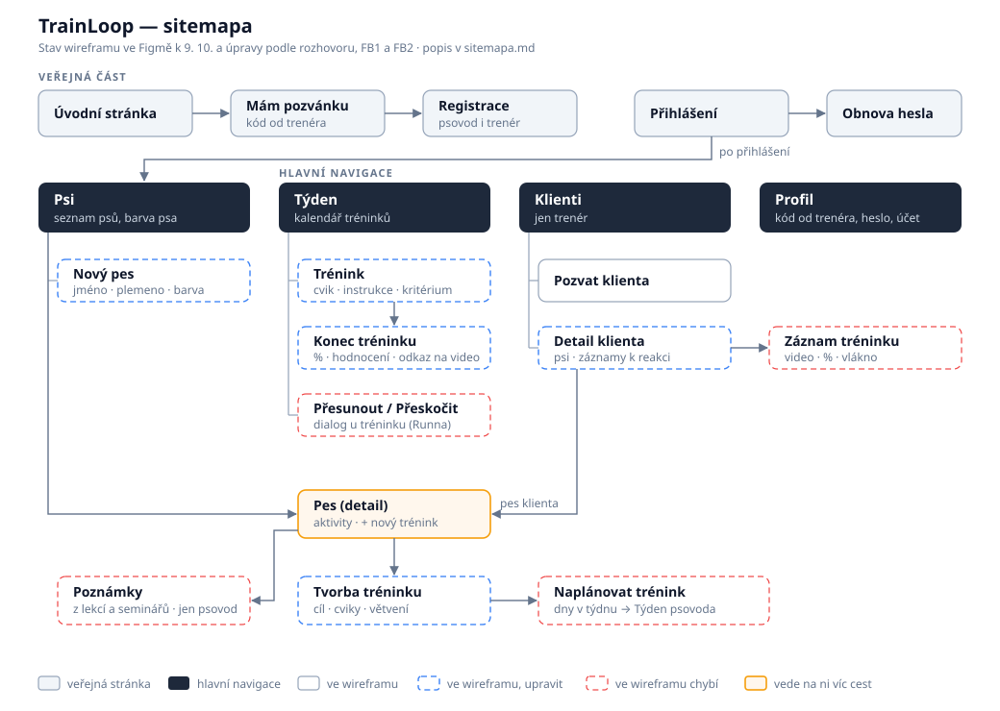

# TrainLoop — Sitemapa

**Stav:** aktualizace 9. 10. 2026 po rozhovoru s trenérkou a FB1 ([plán úprav](plan-uprav-po-fb1.md)). Sloupec _Wireframe_ odpovídá stavu [wireframu ve Figmě](https://www.figma.com/design/IjEnmXXeJB8YBOWPjWiFu3/Trainloop-wireframe?node-id=0-1) k 9. 10. Čísla `F-xx` odkazují na [feature-breakdown.xlsx](feature-breakdown.xlsx).

## Pojmy

| Pojem              | Význam                                                                                                                                               | Příklad                                            |
| ------------------ | ---------------------------------------------------------------------------------------------------------------------------------------------------- | -------------------------------------------------- |
| **Disciplína**     | Oblast, ve které pes trénuje                                                                                                                         | canicross, nosework, poslušnost                    |
| **Cíl**            | Čeho má pes dosáhnout. Může jít o dlouhodobý cíl i drobný trik. Začíná principem: čeho docílit a na co si dát pozor                                  | „spolehlivá chůze u nohy“, „pac“                   |
| **Cvik**           | Jeden konkrétní krok s **instrukcí** (jak cvičit) a **kritériem zvládnutí** (kdy je hotovo)                                                          | „sedni“ · kritérium: sedí, i když kolem letí míčky |
| **Sekvence cviků** | Několik cviků, které jdou vždy po sobě jako jeden blok                                                                                               | rozběh → 3× 400 m → vyklusání                      |
| **Plán**           | Cviky a sekvence k cíli seřazené za sebou. Krok, který pes nechápe, se může rozdělit na dílčí kroky. Trenér ho skládá na obrazovce _Tvorba tréninku_ | „Trénink pro Rexe“ ve wireframu                    |
| **Trénink**        | Jedno cvičení v konkrétní den v kalendáři. Psovod ho prochází cvik po cviku, může ho přesunout nebo přeskočit                                        | „Alík Canicross Trénink“ v pátek                   |
| **Záznam**         | Co psovod po tréninku odešle: % úspěšnosti, rychlé hodnocení, poznámka a odkaz na video. Pod záznamem běží vlákno s trenérem                         |                                                    |

## Jak vzniká a probíhá trénink

1. **Trenér pozve klienta** (Klienti → Pozvat klienta). Klient na úvodní obrazovce zvolí _Mám pozvánku_, zaregistruje se a založí psa. Pes se trenérovi objeví v _Klientech_.
2. **Trenér otevře psa klienta:** _Klienti_ → _Detail klienta_ → jeho pes → _Pes_. Je to stejná obrazovka, jakou vidí psovod u svého psa.
3. **Trenér složí plán:** na obrazovce _Pes_ tlačítkem + otevře _Tvorbu tréninku_. Zadá cíl a princip, pak přidává bloky _Jednotlivý cvik_ a _Sekvence cviků_, každý cvik s instrukcí a kritériem. Krok, který pes nechápe, rozdělí na dílčí kroky.
4. **Trenér plán naplánuje:** vybere dny v týdnu a období (od–do). Tréninky se klientovi objeví v _Týdnu_ a v _Aktivitách_ psa, rozvrh po týdnech a dnech jako v aplikaci Runna.
5. **Psovod trénuje.** Otevře trénink a prochází cviky jeden po druhém („Aktuální cvik 3/20“) s instrukcí a kritériem u každého. Když trénink nestihne, **přesune** ho na jiný den nebo ho **přeskočí**.
6. **Psovod odešle záznam.** Na obrazovce _Konec_ zadá % úspěšnosti, rychlé hodnocení a poznámku, vloží odkaz na video a odešle.
7. **Trenér reaguje.** V _Detailu klienta_ vidí záznamy čekající na reakci. Otevře _Záznam tréninku_, odpoví ve vlákně a podle potřeby upraví plán v _Tvorbě tréninku_. Psovod u tréninku uvidí štítek „nová odpověď“.

## Obrazovky

Sloupec _Wireframe_: název rámce ve Figmě, „upravit“, pokud rámec existuje, ale je potřeba ho změnit podle [plánu úprav](plan-uprav-po-fb1.md), nebo „chybí“.

| Obrazovka                              | Wireframe                                                | Co na ní je                                                                                                                                                         | Features         |
| -------------------------------------- | -------------------------------------------------------- | ------------------------------------------------------------------------------------------------------------------------------------------------------------------- | ---------------- |
| **Úvodní stránka**                     | Uvodní stránka (upravit text: webová aplikace pro mobil) | Co je TrainLoop, tlačítka _Mám pozvánku_, _Přihlásit se_, _Registrace_                                                                                              | —                |
| ↳ Mám pozvánku                         | Pozvánka (modál)                                         | Zadání kódu od trenéra (nebo otevření odkazu z e-mailu), pak registrace a propojení s trenérem                                                                      | F-08, F-09       |
| ↳ Registrace, Přihlášení, Obnova hesla | Registrace psovoda, Přihlášení (modál), Zapomenuté heslo | Standardní formuláře                                                                                                                                                | F-01, F-02       |
| **Psi**                                | Psi                                                      | Seznam psů s fotkou, jménem a plemenem. Barevný proužek = barva psa v kalendáři. Tlačítko + přidá psa                                                               | F-04, F-06       |
| ↳ Nový pes                             | chybí                                                    | Jméno, plemeno, fotka, disciplíny                                                                                                                                   | F-04, F-05       |
| ↳ **Pes** (detail)                     | Pes (upravit)                                            | Fotka, jméno, plemeno a _Aktivity_: tréninky po dnech se záznamy, videi a odpověďmi trenéra. Tlačítko + vede na _Tvorbu tréninku_                                   | F-07, F-26       |
| ↳ ↳ **Tvorba tréninku**                | Tvorba tréninku (upravit)                                | Cíl a princip, bloky _Jednotlivý cvik_ a _Sekvence cviků_ s instrukcí a kritériem, rozdělení kroku na dílčí kroky, + přidat blok, koš smazat                        | F-12 – F-16      |
| ↳ ↳ ↳ Naplánovat trénink               | chybí                                                    | Dny v týdnu a období (od–do). Tréninky se pak objeví v Týdnu klienta                                                                                                | F-20             |
| **Týden**                              | Týden (upravit)                                          | Výběr týdne, dny Po–Ne s barevnými proužky podle psů. Po kliknutí na den karta tréninku se seznamem cviků, stavem (odcvičeno / přeskočeno) a štítkem „nová odpověď“ | F-19, F-22, F-33 |
| ↳ Přesunout / Přeskočit                | chybí                                                    | Dialog u tréninku: přesunout na jiný den či týden, nebo přeskočit                                                                                                   | F-21             |
| ↳ Trénink (průchod)                    | Trénink (upravit)                                        | „Aktuální cvik 3/20“, název cviku, instrukce a kritérium, šipkami na předchozí a další cvik                                                                         | F-43, F-13       |
| ↳ Trénink (konec)                      | Trénink (upravit)                                        | % úspěšnosti, rychlé hodnocení, poznámka, **odkaz** na video (místo „Nahrát video“), _Odeslat_                                                                      | F-24, F-25, F-44 |
| **Klienti** (jen trenér)               | Klienti                                                  | Karty klientů (jméno, e-mail), štítek „čeká na reakci“, tlačítko + pozve klienta                                                                                    | F-31, F-32       |
| ↳ Pozvat klienta                       | ve Figmě pod názvem „Zapomenuté heslo )“                 | E-mail klienta nebo kód / odkaz k předání na lekci                                                                                                                  | F-08, F-09       |
| ↳ Detail klienta                       | detail klienta (upravit)                                 | Psi klienta (klik vede na _Pes_) a seznam záznamů čekajících na reakci. Dnes je tu jeden chat s celým klientem, vlákno ale patří pod konkrétní trénink              | F-31, F-32       |
| ↳ ↳ Záznam tréninku                    | chybí                                                    | Odeslaný záznam (video, %, hodnocení, poznámka) a vlákno s trenérem. Psovod se sem dostane z Týdne nebo z Aktivit psa                                               | F-30, F-33       |
| **Profil**                             | Účet                                                     | Jméno, e-mail, změna hesla, odhlásit se, smazat účet                                                                                                                | F-01, F-39       |

**Navigace** (spodní lišta): psovod _Psi · Týden · Profil_, trenér navíc _Klienti_. Ve wireframu jsou zatím popisky „TAB 2 / TAB 4 / TAB 5“.

## Hlavní cesty

1. **Trenér začíná:** Registrace → Klienti → Pozvat klienta.
2. **Klient se připojí:** Úvodní stránka → Mám pozvánku → Registrace → Nový pes → pes se trenérovi objeví v Klientech.
3. **Trenér zadá trénink:** Klienti → Detail klienta → Pes → + → Tvorba tréninku (cíl, princip, cviky) → Naplánovat trénink → trénink je v Týdnu klienta.
4. **Psovod trénuje:** Týden → den → Trénink (cvik po cviku) → Konec → %, hodnocení, poznámka, odkaz na video → Odeslat.
5. **Psovod nestihne trénink:** Týden → trénink → Přesunout (jiný den či týden), nebo Přeskočit.
6. **Trenér reaguje:** Klienti („čeká na reakci“) → Detail klienta → Záznam tréninku → odpověď ve vlákně → případně úprava v Tvorbě tréninku.
7. **Psovod si přečte odpověď:** Týden (štítek „nová odpověď“) nebo Pes → Aktivity → Záznam tréninku.

## Systémové obrazovky a stavy

| Situace                                                    | Co uživatel uvidí                                                               |
| ---------------------------------------------------------- | ------------------------------------------------------------------------------- |
| Prázdné stavy (bez psa, prázdný týden, trenér bez klientů) | Výzva k dalšímu kroku: přidat psa, počkat na trénink od trenéra, pozvat klienta |
| Neplatná nebo vypršelá pozvánka / kód                      | Vysvětlení a co dělat dál                                                       |
| Trenér ukončil spolupráci                                  | „K tomuto psovi už nemáte přístup“                                              |
| Nevratná akce (smazání bloku, psa, účtu)                   | Potvrzovací dialog                                                              |
| Neexistující stránka, chyba serveru                        | 404 / chybová obrazovka s možností zkusit znovu                                 |

Otevřené otázky jsou v [otazky-fb2.md](otazky-fb2.md), zodpovězené z FB1 v [otazky-na-klienta.md](otazky-na-klienta.md).
